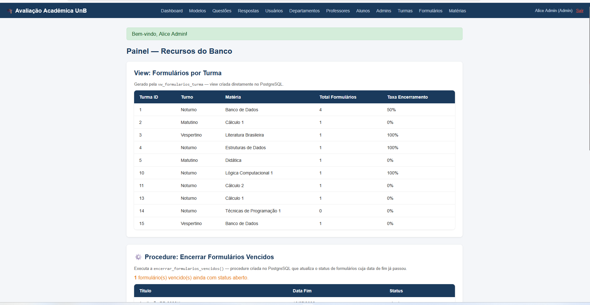
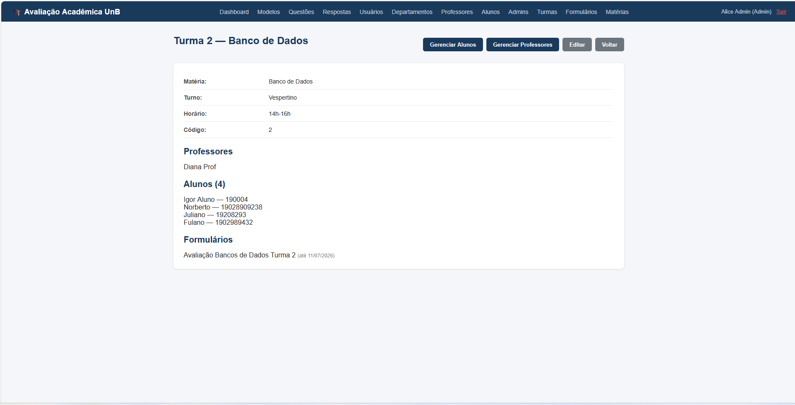
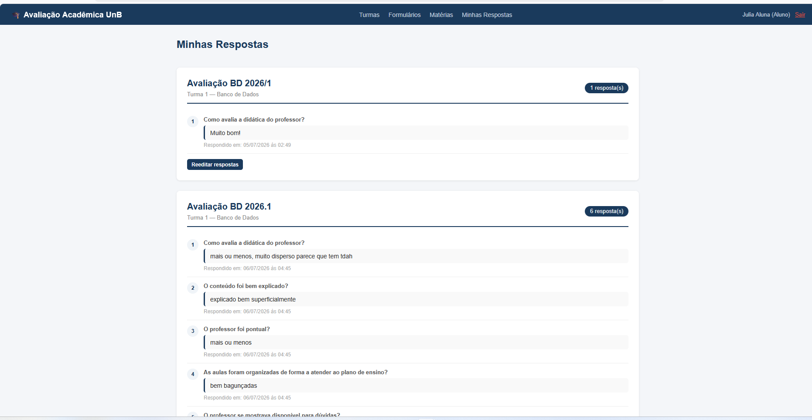
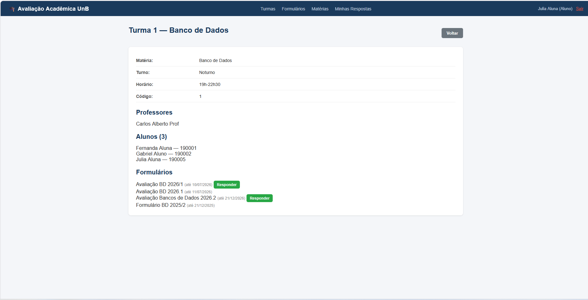

# 🎓 Sistema de Avaliação Acadêmica Institucional

> Projeto de Banco de Dados — Licenciatura em Computação  
> Universidade de Brasília (UnB) — Departamento de Ciência da Computação  
> Disciplina: Bancos de Dados (CIC0097) — 2026/1

---

## 📋 Sobre o Projeto

Sistema web para avaliação institucional de turmas da UnB. Professores criam formulários de avaliação para suas turmas, alunos respondem os formulários e administradores gerenciam toda a estrutura acadêmica.

O sistema permite:
- Cadastro e gerenciamento de departamentos, matérias, turmas, professores e alunos
- Criação de modelos de avaliação com questões personalizadas
- Envio de formulários de avaliação para turmas específicas
- Resposta de formulários pelos alunos com histórico de respostas
- Painel administrativo com view, procedure e trigger do PostgreSQL

---

## 🖥️ Capturas de Tela

### Painel Administrativo — View e Procedure


### Turma — Visão do Admin


### Minhas Respostas — Visão do Aluno


### Turma — Visão do Aluno


---

## 🛠️ Tecnologias Utilizadas

| Camada | Tecnologia |
|---|---|
| Linguagem | Ruby 3.4.5 |
| Framework | Ruby on Rails 8.0 |
| Banco de Dados | PostgreSQL 15+ |
| Frontend | ERB + CSS customizado |
| Upload de arquivos | Active Storage + bytea (PostgreSQL) |
| Gerenciador de versões | mise |
| Gerenciador de pacotes | Bundler |

---

## 🗄️ Modelo de Dados

O sistema possui **14 entidades** organizadas em três camadas:

### Entidades principais
| Entidade | Descrição |
|---|---|
| `Departamento` | Unidade organizacional da instituição |
| `Materia` | Disciplina oferecida por um departamento |
| `Turma` | Turma de uma matéria com turno e horário |
| `Usuario` | Entidade base com dados comuns de acesso |
| `Aluno` | Especialização de Usuario com matrícula |
| `Professor` | Especialização de Usuario com data de contratação |
| `Admin` | Especialização de Usuario com nível de acesso |
| `Questao` | Pergunta de avaliação criada por professor ou admin |
| `Modelo` | Template de formulário contendo questões |
| `Formulario` | Avaliação gerada de um modelo e enviada a uma turma |
| `Resposta` | Resposta de um aluno a uma questão de um formulário |

### Tabelas de relacionamento N:N
| Tabela | Relacionamento |
|---|---|
| `Aluno_Turma` | Alunos matriculados em turmas |
| `Professor_Turma` | Professores vinculados a turmas |
| `Modelo_Questao` | Questões contidas em modelos |
| `Admin_Turma` | Admins responsáveis por turmas |

---

## ⚙️ Recursos do Banco de Dados

### View — `vw_formularios_turma`
Consolida dados de formulários por turma, exibindo total de formulários e taxa de encerramento.

```sql
CREATE VIEW public.vw_formularios_turma AS
  SELECT t.id AS turma_id, t.turno, m.nome AS materia,
         COUNT(f.id) AS total_formularios,
         AVG(CASE WHEN f.status = 'encerrado' THEN 1 ELSE 0 END) AS taxa_encerramento
  FROM turma t
  JOIN materia m ON m.id = t.idmateria
  LEFT JOIN formulario f ON f.idturma = t.id
  GROUP BY t.id, t.turno, m.nome;
```

### Procedure — `encerrar_formularios_vencidos()`
Atualiza automaticamente o status de formulários cuja data de fim já passou.

```sql
CREATE PROCEDURE public.encerrar_formularios_vencidos()
LANGUAGE plpgsql AS $$
BEGIN
  UPDATE formulario
  SET status = 'encerrado'
  WHERE data_fim < CURRENT_DATE AND status != 'encerrado';
END;
$$;
```

### Triggers
**`trg_respondido_em`** — Preenche `respondido_em` automaticamente ao inserir uma resposta, sem necessidade de passar o campo no formulário.

**`trg_questao_atualizado_em`** e **`trg_modelo_atualizado_em`** — Atualizam `atualizado_em` automaticamente ao editar questões e modelos.

### Dado Binário
Formulários suportam anexo de arquivos (PDF, imagens) armazenados diretamente no PostgreSQL como `bytea` na coluna `anexo_binario`.

---

## 👥 Perfis de Usuário

### 🔴 Admin
- Gerencia toda a estrutura: departamentos, matérias, turmas, professores, alunos e admins
- Vincula e desvincula professores de turmas
- Cria e edita todos os modelos, questões e formulários
- Acessa o painel com view, procedure e triggers
- Executa a procedure de encerramento de formulários

### 🔵 Professor
- Gerencia alunos nas turmas às quais está vinculado
- Cria e edita modelos e questões próprios
- Cria e envia formulários para suas turmas
- Visualiza respostas dos alunos

### 🟢 Aluno
- Visualiza apenas suas turmas e matérias associadas
- Responde formulários abertos de suas turmas
- Visualiza e reedita suas próprias respostas agrupadas por formulário

---

## 🚀 Como Rodar Localmente

### Pré-requisitos
- Ruby 3.4.5
- Rails 8.0
- PostgreSQL 15+
- Bundler

### 1. Clonar o repositório

```bash
git clone https://github.com/seu-usuario/projetobd_26.git
cd projetobd_26
```

### 2. Instalar dependências

```bash
bundle install
```

### 3. Configurar variáveis de ambiente

Crie um arquivo `.env` ou exporte as variáveis no terminal:

```bash
export BD_26_DATABASE_PASSWORD="sua_senha_do_postgres"
```

### 4. Configurar o banco de dados

```bash
# Criar o banco
sudo -u postgres psql -c "CREATE DATABASE projetobd_development OWNER seu_usuario;"

# Carregar o schema
sudo -u postgres psql -d projetobd_development -f db/structure.sql

# Rodar migrations do Rails (Active Storage)
bundle exec rails db:migrate
```

### 5. Criar a view, procedure e triggers no banco

```bash
sudo -u postgres psql -d projetobd_development
```

```sql
CREATE OR REPLACE FUNCTION public.atualizar_status_resposta()
RETURNS trigger LANGUAGE plpgsql AS $$
BEGIN
  NEW.respondido_em = NOW();
  RETURN NEW;
END;
$$;

CREATE OR REPLACE FUNCTION public.atualizar_timestamp()
RETURNS trigger LANGUAGE plpgsql AS $$
BEGIN
  NEW.atualizado_em = NOW();
  RETURN NEW;
END;
$$;

CREATE OR REPLACE PROCEDURE public.encerrar_formularios_vencidos()
LANGUAGE plpgsql AS $$
BEGIN
  UPDATE formulario SET status = 'encerrado'
  WHERE data_fim < CURRENT_DATE AND status != 'encerrado';
END;
$$;

CREATE TRIGGER trg_respondido_em
  BEFORE INSERT ON resposta
  FOR EACH ROW EXECUTE FUNCTION public.atualizar_status_resposta();

CREATE TRIGGER trg_questao_atualizado_em
  BEFORE UPDATE ON questao
  FOR EACH ROW EXECUTE FUNCTION public.atualizar_timestamp();

CREATE TRIGGER trg_modelo_atualizado_em
  BEFORE UPDATE ON modelo
  FOR EACH ROW EXECUTE FUNCTION public.atualizar_timestamp();

CREATE VIEW public.vw_formularios_turma AS
  SELECT t.id AS turma_id, t.turno, m.nome AS materia,
         COUNT(f.id) AS total_formularios,
         AVG(CASE WHEN f.status = 'encerrado' THEN 1 ELSE 0 END) AS taxa_encerramento
  FROM turma t
  JOIN materia m ON m.id = t.idmateria
  LEFT JOIN formulario f ON f.idturma = t.id
  GROUP BY t.id, t.turno, m.nome;
```

### 6. Popular o banco com dados de exemplo

```bash
bundle exec rails db:seed
```

### 7. Iniciar o servidor

```bash
# Certifique-se que o PostgreSQL está rodando
sudo service postgresql start

# Iniciar o servidor Rails
bundle exec rails server
```

Acesse em: **http://localhost:3000**

### Usuário padrão para login

| Email | Senha | Tipo |
|---|---|---|
| alice@unb.br | 123456 | Admin |
| carlos@unb.br | 123456 | Professor |
| fernanda@unb.br | 123456 | Aluno |

---

## 📁 Estrutura do Projeto

```
projetobd_26/
├── app/
│   ├── controllers/     # Controllers de cada entidade
│   ├── models/          # Models com associações e validações
│   └── views/           # Views ERB por entidade
├── config/
│   ├── routes.rb        # Rotas do sistema
│   └── database.yml     # Configuração do banco
├── db/
│   ├── structure.sql    # Schema do banco gerado automaticamente
│   ├── seeds.rb         # Dados iniciais para teste
│   └── migrate/         # Migrations do Rails
└── README.md
```

---

## 🤖 Indicação de Uso de Inteligência Artificial

A IA Generativa (Claude — Anthropic) foi utilizada extensivamente neste projeto como ferramenta de apoio ao desenvolvimento, incluindo:

- Geração e revisão do script SQL do banco de dados
- Desenvolvimento dos models, controllers e views em Ruby on Rails
- Correção de erros e depuração de código
- Implementação dos recursos avançados do banco (view, procedure, triggers)
- Configuração do ambiente de desenvolvimento (WSL2, PostgreSQL, Rails)
- Criação do sistema de autenticação e controle de acesso por perfil
- Otimização de queries (eliminação de N+1)
- Elaboração deste README

O uso da IA foi declarado conforme exigido pela especificação do projeto.

---

## 👨‍💻 Integrantes

| Nome | Matrícula |
|---|---|
| Mateus Santos da Silva | 190018011 |
| Luiz Carlos Campos de Alencar | 241004560 |

---

## 📄 Licença

Projeto acadêmico desenvolvido para a disciplina de Bancos de Dados — UnB 2026/1.
